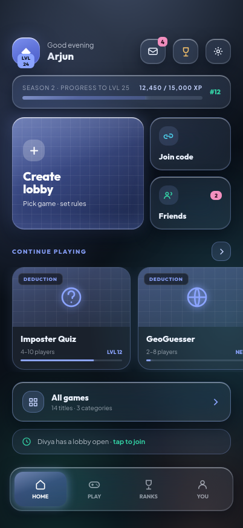
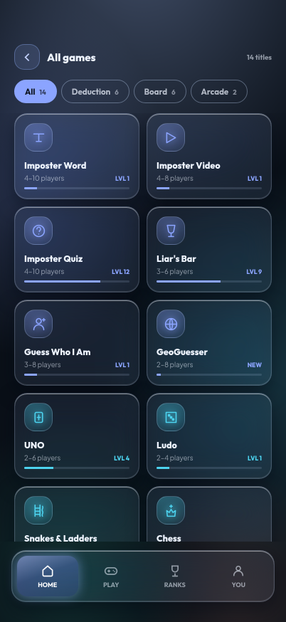
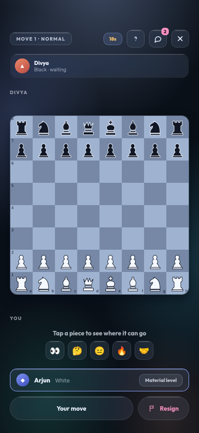
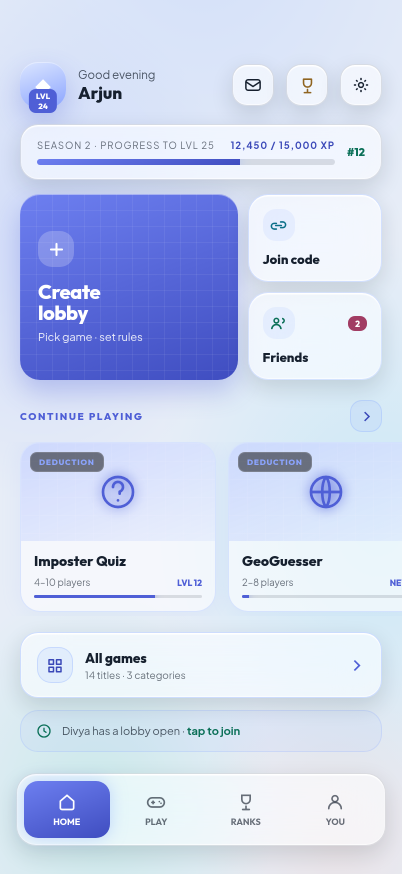

# Loophole

A party games app for the phone in your pocket. Fourteen titles, one lobby, one
ladder — and every one of them genuinely playable against bots, so a game is
never waiting on a fourth person to show up.

Built with Expo and React Native.

> **[Install the Android APK →](https://github.com/AnushKulal/loophole/releases/latest)**
> Scan the QR on the release page with your phone's camera. Android will ask
> once for permission to install from your browser — expected for anything that
> doesn't come from the Play Store.

<p align="center">
  
  
  
  
</p>

## The games

| | Deduction | Board | Arcade |
| --- | --- | --- | --- |
| | Imposter Word · 4–10 | UNO · 2–6 | 3D Tank War · 2–8 |
| | Imposter Video · 4–8 | Ludo · 2–4 | Gravity Flip · 2–4 |
| | Imposter Quiz · 4–10 | Snakes & Ladders · 2–4 | |
| | Liar's Bar · 3–6 | Chess · 2 | |
| | Guess Who I Am · 3–8 | Carrom · 2–4 | |
| | GeoGuesser · 2–8 | Connect 4 · 2 | |

Every title has a real rules engine behind it rather than a scripted demo —
Chess knows about en passant, castling, the fifty-move rule and threefold
repetition; UNO enforces stacking and colour choice; Carrom and the two arcade
titles run their own physics. The bots come in four strengths and think for a
moment before moving, because an instant reply reads as a machine.

Around the games sits the rest of the app: lobbies with join codes, friends and
DMs, a season pass, a leaderboard, spectating, tournament brackets, and a tint
shop whose accent colour follows you through every screen.

## Running it

```bash
cd mobile
npm install
npx expo start        # scan the QR with Expo Go, or press 'a' for an emulator
```

Also useful:

```bash
npm test              # the rules engines — 682 tests
npx tsc --noEmit      # typecheck
npm run share         # serve over a tunnel; the QR works from anywhere
```

`npm run share` is the iPhone route. An iOS build can't be sideloaded the way an
APK can, so iPhones run Loophole inside Expo Go — install it from the App Store,
scan the QR that command prints, and the app opens. See
[docs/SHIP_THE_APK.md](docs/SHIP_THE_APK.md) for the permanent-link and
TestFlight routes.

## Building an APK

Push to `main` and the **Android APK** workflow builds a signed release,
publishes it as a GitHub Release, and puts a QR code on the release page. It
builds with Gradle on the runner, so it needs no Expo account and no secrets —
without a keystore it signs with a key generated for that run.

That fallback has one consequence worth knowing: Android refuses to install an
APK over one signed by a different key, so testers have to uninstall between
builds until you add a real keystore. `docs/SHIP_THE_APK.md` has the `keytool`
command and the four secrets.

## How it's put together

```
mobile/
  src/
    theme/       the palette as plain values, plus the provider
    components/  base.tsx (primitives), GameChrome.tsx (game furniture),
                 AppChrome.tsx (tab bar, sheets, banners), Background.tsx
    data/        fixture data — games, people, progression
    game/        one pure rules engine per title, plus contract.ts and registry.ts
    lib/         setup options and lobby seat derivation
    screens/     one file per screen; screens/games/ holds the playable titles
    store/       app state and every action, held outside React
  plugins/       config plugins applied at prebuild — release signing lives here
app/             the React + Vite web build this was ported from
project/         the original Claude Design prototypes
```

The rules engines are pure TypeScript with no React and no React Native import,
which is why they test in plain node in under a minute and why the port from web
to native left them untouched. State lives outside React in a store read through
`useSyncExternalStore`, so a timer-driven game loop can't read a stale closure.

Adding a game is three files — a pure engine, its tests, and a screen
implementing `GameScreenProps` — plus one line in `src/game/registry.ts`.
[mobile/docs/GAME_AUTHORING.md](mobile/docs/GAME_AUTHORING.md) walks through it.
[mobile/docs/RN_PORTING.md](mobile/docs/RN_PORTING.md) records the traps that
came up moving the design from CSS to React Native — blur, gradients, shadows
and light pools all needed rebuilding rather than translating.

## Where it came from

The design was mocked up in [Claude Design](https://claude.ai/design) as HTML
prototypes, exported as a handoff bundle, and implemented first as a React + Vite
web app and then rebuilt in Expo. `project/` holds the original prototypes and
`chats/` the design conversation; both are kept as the visual reference the
native build is checked against.

## Status

Every screen and all fourteen games have been verified by rendering the app
through `react-native-web` and driving it with a browser — but **not yet on a
physical Android device**. Blur fidelity, gesture feel and the arcade titles'
frame rate are unproven on real hardware. See
[issue #1](https://github.com/AnushKulal/loophole/issues/1) for what's left.
